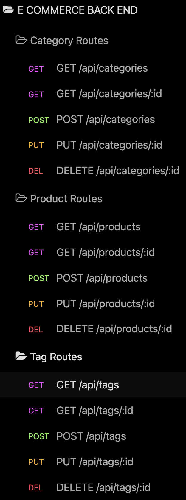

# e-commerce back end

<div style="position: absolute; top: 22px; right: 50px">


</div>

## Description
Need a back end for your online store? e-Commerce back end can handle product, tag and category relationships with api endpoints for creating, reading, updating and deleting data. Just connect this application to a MySQL database, add a front end, load in all your product data, and then start making sales!


## Table of Contents
  - [Description](#description)
  - [Installation](#installation)
  - [Usage](#usage)
  - [Database](#database)
  - [API_Routes](#API_Routes)
  - [Questions](#questions)
  - [License](#license)

<a href = "#installation"></a>

## Installation
This application requires MySQL and node.js to run locally. You can connect to a MySQL database remotely as well.

- Clone this repository to your machine. 
- Navigate to the root directory in your terminal
- Run the command ```npm i``` to install all dependencies
- If you plan to run the application locally:
  - run ```touch .env``` then:
    - Open your .env file ```open .env``` and add the following variables to configure the connection to your MySQL database
      ```
        DB_NAME='ecommerce_db'
        DB_USER='root'   <<< your MySQL username
        DB_PW='secret'   <<< your MySQL password
      ```
  - On first use:
    - Open the MySQL monitor (```npm run db```) -OR- (```mysql -u root -p```)
      - Enter your MySQL password.
      - To create your ecommerce_db database
        - Run ```source db/schema.sql```
      - Then run ```quit``` to leave the mySQL monitor 
- If you would like to test the application with dummy data
- Run ```npm run seed``` from the command line

- Run ```npm start``` to start your server

## Usage
This application has no front end! You can use insomnia core or an API designer of your choosing to interact with the API endpoint the application provides. If you decide to use this back-end for your store, you will need to build and connect a front end.

`Click the screen-shot below to watch an installation and usage demo video`

[](https://youtu.be/kiUWRrnP-CQ)

## Database
### `Tables`
#### `category`
- id
  - Integer
  - Doesn't allow null values
  - Set as primary key
  - Uses auto increment
- category_name
  - String
  - Doesn't allow null values
  - Is Unique

#### `product`
- id
  - Integer
  - Doesn't allow null values
  - Set as primary key
  - Uses auto increment
- product_name
  - String
  - Doesn't allow null values
- price
  - Decimal
  - Doesn't allow null values
  - Validates that the value is a decimal
- stock
  - Integer
  - Doesn't allow null values
  - Set a default value of 10
  - Validates that the value is numeric
- category_id
  - Integer
  - References the category model's id

#### `tag`
- id
  - Integer
  - Doesn't allow null values
  - Set as primary key
  - Uses auto increment
- tag_name
  - String

#### `product_tag`
  - id
    - Integer
    - Doesn't allow null values
    - Set as primary key
    - Uses auto increment
- product_id
  - Integer
  - References the product model's id
- tag_id
  - Integer
  - References the tag model's id

### `Model Associations`

- Product belongs to Category
- Category has many Product.
  - a category can have multiple products but a product can only belong to one category.


- Product belongs to many Tag models. 
- Tag belongs to many Product models.
  - Using the ProductTag through model, allow products to have multiple tags and tags to have many products.

## API_Routes

### ```Category Routes```
- GET /api/catagories
  - returns all catagories with associated products
- GET /api/catagories/:id
  - returns one category by id with associated products
- POST /api/catagories
  - create a new product category
  - expects req.body == { "category_name": "STRING" }
- PUT /api/catagories/:id
  - update an existing category by id
  - expects req.body == { "category_name": "STRING" }
- DELETE /api/catagories/:id
  - Delete a category by id

### ```Tag Routes```
- GET /api/tags
  - returns all tags with associated products
- GET /api/tags/:id
  - returns one tag by id with associated products
- POST /api/tags
  - create a new product tag
  - expects req.body == { "tag_name": "STRING" }
- PUT /api/tags/:id
  - update an existing product tag
  - expects req.body == { "tag_name": "STRING" }
- DELETE /api/tags/:id
  - Delete a tag by id

### ```Product Routes```
- GET /api/products
  - returns all products with associated category and tags
- GET /api/products/:id
  - returns one product by id with associated category and tags
- POST /api/products
  - create a new product with associated category and tags
  - expects req.body...
    ```json
      {
        "product_name": "STRING",
        "price": DECIMAL,
        "stock": INTEGER,
        "category_id": INTEGER,
        "tagIds": [INTEGER, INTEGER, ...]
      }
    ```
- PUT /api/products/:id
  - update a product by id
  - expects same req.body
- DELETE /api/products/:id
  - delete a product by id


## Questions

- Feel free to reach out with any questions

### Contact information:
- GitHub: [matt-gross-27](https://www.github.com/matt-gross-27)
- Email: [mbgross111@gmail.com](mailto:mbgross111@gmail.com)


## License
- MIT